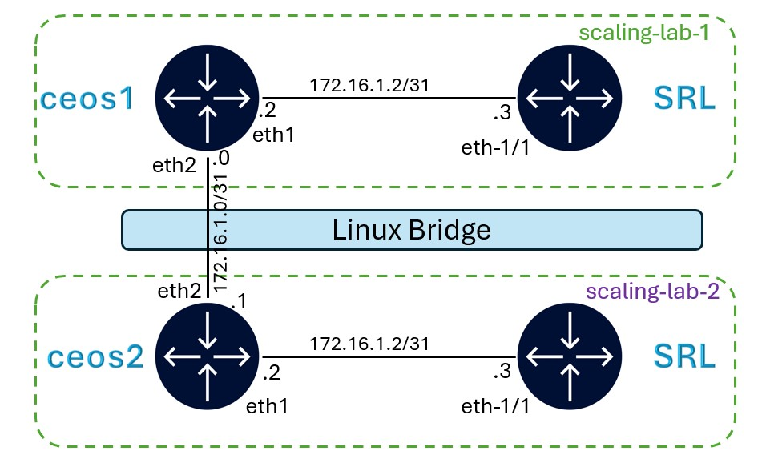

# Lab Scaling

Containerlab provides various options to scale the lab infrastructure and for external communication to systems that are not managed in Containerlab.

Some of those options are:
- Using a Linux bridge interface
- Attaching a containerlab node interface to the physical server interface
- Using macvlan

In this section, we will explore the Linux bridge interface option using 2 labs connected by a linux bridge.

## Lab Topology



`scaling-lab-1` has a SR Linux node and IOSXE (c8000v) node.

`scaling-lab-2` also has a SR Linux node and IOSXE node.

Both the IOSXE nodes are connected using the Linux bridge.

Startup configs are used to configure the interface and BGP session between the 2 IOSXE nodes.

## Linux Bridge

Before we deploy the lab, create the linux bridge manually.

On your VM:

```bash
sudo ip link add br-clab type bridge
sudo ip link set br-clab up
```

## Deploy the labs

Deploy the first lab.

```bash
cd ~/wk320/25-scaling
clab dep -t 1.scale.clab.yml
```

After the first lab is successfuly deployed, deploy the 2nd lab.

```bash
clab dep -t 2.scale.clab.yml
```

Wait for both IOSXE nodes to boot up (~2 mins). You may monitor the boot logs using `docker logs -f <nodename>`.

## Checking BGP status

Login to any IOSXE node in either lab and check the BGP neighbor status.

```bash
show bgp ipv4 unicast summary
```

The BGP neighbor session to the SR Linux node in the local lab should be UP.

Also, the BGP neighbor session to the IOSXE node in the other lab should be UP.

## Monitoring traffic on the bridge

To confirm that traffic between the 2 IOSXE nodes is passing through the bridge, startup a tcpdump of the bridge interface on the VM.

On your VM host, run:

```bash
sudo tcpdump -i br-clab
```

Login to iosxe node in first lab and ping iosxe2 interface IP.

```srl
ping 172.16.1.1
```

Check the output of tcpdump for the bridge interface. It will display the ICMP packets going back and forth between the 2 iosxe devices.

```bash
tcpdump: verbose output suppressed, use -v or -vv for full protocol decode
listening on br-clab, link-type EN10MB (Ethernet), capture size 262144 bytes
08:42:48.891941 IP 172.16.1.1 > 172.16.1.0: ICMP echo request, id 1, seq 0, length 80
08:42:48.892327 IP 172.16.1.0 > 172.16.1.1: ICMP echo reply, id 1, seq 0, length 80
08:42:48.892957 IP 172.16.1.1 > 172.16.1.0: ICMP echo request, id 1, seq 1, length 80
08:42:48.893149 IP 172.16.1.0 > 172.16.1.1: ICMP echo reply, id 1, seq 1, length 80
08:42:48.893721 IP 172.16.1.1 > 172.16.1.0: ICMP echo request, id 1, seq 2, length 80
```

That concludes the scaling lab.

You may now destroy the lab.

```bash
clab des -t 1.scale.clab.yml
clab des -t 2.scale.clab.yml
```


