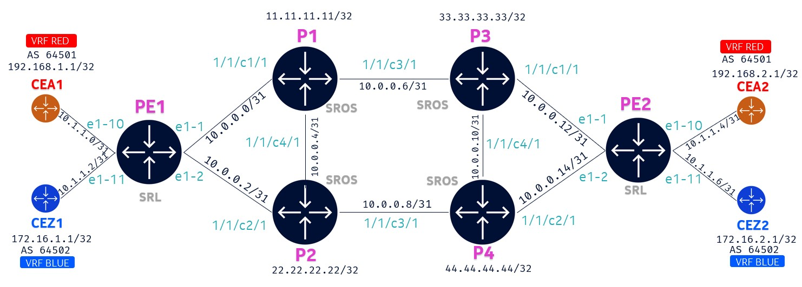

# Lab Topology



# Deploying the lab

To deploy the lab, run the following:

```bash
cd ~/cwrk/ipvpn
sudo clab deploy -t vm.clab.yml
```

Containerlab will deploy the lab and display a table with the list of nodes and their IPs.

```bash
╭──────┬──────────────────────────────┬─────────┬───────────────────╮
│ Name │          Kind/Image          │  State  │   IPv4/6 Address  │
├──────┼──────────────────────────────┼─────────┼───────────────────┤
│ cea1 │ nokia_srlinux                │ running │ 172.20.20.6       │
│      │ ghcr.io/nokia/srlinux:25.3.1 │         │ 3fff:172:20:20::6 │
├──────┼──────────────────────────────┼─────────┼───────────────────┤
│ cea2 │ nokia_srlinux                │ running │ 172.20.20.7       │
│      │ ghcr.io/nokia/srlinux:25.3.1 │         │ 3fff:172:20:20::7 │
├──────┼──────────────────────────────┼─────────┼───────────────────┤
│ cez1 │ nokia_srlinux                │ running │ 172.20.20.3       │
│      │ ghcr.io/nokia/srlinux:25.3.1 │         │ 3fff:172:20:20::3 │
├──────┼──────────────────────────────┼─────────┼───────────────────┤
│ cez2 │ nokia_srlinux                │ running │ 172.20.20.5       │
│      │ ghcr.io/nokia/srlinux:25.3.1 │         │ 3fff:172:20:20::5 │
├──────┼──────────────────────────────┼─────────┼───────────────────┤
│ p1   │ nokia_sros                   │ running │ 172.20.20.2       │
│      │ vrnetlab/nokia_sros:25.3.R1  │         │ 3fff:172:20:20::2 │
├──────┼──────────────────────────────┼─────────┼───────────────────┤
│ p2   │ nokia_sros                   │ running │ 172.20.20.4       │
│      │ vrnetlab/nokia_sros:25.3.R1  │         │ 3fff:172:20:20::4 │
├──────┼──────────────────────────────┼─────────┼───────────────────┤
│ p3   │ nokia_sros                   │ running │ 172.20.20.8       │
│      │ vrnetlab/nokia_sros:25.3.R1  │         │ 3fff:172:20:20::8 │
├──────┼──────────────────────────────┼─────────┼───────────────────┤
│ p4   │ nokia_sros                   │ running │ 172.20.20.9       │
│      │ vrnetlab/nokia_sros:25.3.R1  │         │ 3fff:172:20:20::9 │
├──────┼──────────────────────────────┼─────────┼───────────────────┤
│ pe1  │ nokia_srlinux                │ running │ 172.20.20.11      │
│      │ ghcr.io/nokia/srlinux:25.3.1 │         │ 3fff:172:20:20::b │
├──────┼──────────────────────────────┼─────────┼───────────────────┤
│ pe2  │ nokia_srlinux                │ running │ 172.20.20.10      │
│      │ ghcr.io/nokia/srlinux:25.3.1 │         │ 3fff:172:20:20::a │
╰──────┴──────────────────────────────┴─────────┴───────────────────╯
```

To display all deployed labs on your VM at any time, use:

```bash
sudo clab inspect --all
```

## Connecting to the devices

Find the nodename or IP address of the device from the above output and then use SSH.

```bash
ssh pe1
```

To login to the client, identify the client hostname using the `sudo clab inspect --all` command above and then:

```bash
sudo docker exec –it client3 bash
```

## Pre-configuration

All P nodes are pre-configured with SR-ISIS.
All CE nodes are pre-configured with interfaces, loopback and BGP to the PE.

## Physical link connectivity

We will be using [Openconfig](https://www.openconfig.net/) to configure the following:

- Configure interfaces between PE and P nodes
- Configure interface between PE and CE nodes
- Configure system loopback on PE
- Configure default Network Instance (VRF) and add system loopback and Leaf/Spine interfaces to this VRF

We will use [gRPC gNMI](https://www.openconfig.net/docs/gnmi/gnmi-specification/) to push the configuration to the devices.

[gNMIc](https://gnmic.openconfig.net/) is the most widely used client for gNMI and we will use that for this purpose.

The Openconfig configuration files are located at [configs/oc/](./configs/oc).

Before we start, verify the current configured interfaces on PE1 or PE2.

To view Interface status on SR Linux use:

```srl
show interface
```

Only the management interface is configured.

Change to the `OC Running` mode and view the interface configuration in OC.

```
enter oc
```

```
info flat interfaces
```

The management interface configuration can be seen in OC format. The other interfaces are enabled with no IP configuration.

## Using gNMI to push Openconfig

Exit from SR Linux and on your VM, run the following commands to push the configuration in the files to the devices. There is no native configuration for spine as all required configs are covered in Openconfig.

```
gnmic -a 
```

Expected response from each device:

```
{
  "source": "leaf1:57401",
  "timestamp": 1740857162969095065,
  "time": "2025-03-01T21:26:02.969095065+02:00",
  "results": [
    {
      "operation": "UPDATE",
      "path": "openconfig:"
    },
    {
      "operation": "UPDATE",
      "path": "srl_nokia:"
    }
  ]
}
```

### Viewing configuration in OC or native

The configuration that we pushed using OC can be viewed in both OC or native format.

To view in OC format, enter `OC Running` mode and run `info flat interfaces`.

To view in SRL format, enter `SRL Running` mode (if not already there) and run `info flat interface *`.

### Verify reachability between devices

Now that the interfaces are configured, check reachability between PE and P devices using ping.

Example on PE1 to P1:

```srl
ping -c 3 10.0.0.1 network-instance default
```

## SR Linux Configuration Mode

To enter candidate configuration edit mode in SR Linux, use:

```srl
enter candidate
```

To commit the configuration in SR Linux, use:

```srl
commit stay
```

Here's a reference table with some commonly used commands.

| Action | Command |
| --- | --- |
| Enter Candidate mode | `enter candidate {private}` |
| Commit configuration changes | `commit {now\|stay}` |
| | `now` – commits and exits from candidate mode |
| | `stay` – commits and stays in candidate mode |
| Delete configuration elements | `delete` |
| | Eg: `delete interface ethernet-1/5` |
| Discard configuration changes | `discard {now\|stay}` |
| Compare candidate to running | `diff running /` |
| View configuration in current mode & context | `info {flat}` |
| View configuration in another mode & context | `info {flat} from state /interface ethernet-1/1` |
| Output modifiers | `<command> \| as {table\|json\|yaml}` |
| Access Linux shell | `bash` |
| Find a command | `tree flat detail \| grep <keyword>` |
| Exit from the node | `quit` or `CTRL+d` |

## Configuring ISIS

On PE1:

```srl
set / network-instance default protocols isis instance 1 admin-state enable
set / network-instance default protocols isis instance 1 net [ 49.0000.0010.0100.1001.00 ]
set / network-instance default protocols isis instance 1 interface ethernet-1/1.0 circuit-type point-to-point
set / network-instance default protocols isis instance 1 interface ethernet-1/2.0 circuit-type point-to-point
set / network-instance default protocols isis instance 1 interface system0.0 circuit-type point-to-point
```

On PE2:

```srl
set / network-instance default protocols isis instance 1 admin-state enable
set / network-instance default protocols isis instance 1 net [ 49.0000.0020.0200.2002.00 ]
set / network-instance default protocols isis instance 1 interface ethernet-1/1.0 circuit-type point-to-point
set / network-instance default protocols isis instance 1 interface ethernet-1/2.0 circuit-type point-to-point
set / network-instance default protocols isis instance 1 interface system0.0 circuit-type point-to-point
```

### Verifying ISIS

On either PE1 or PE2:

```srl
show network-instance default protocols isis adjacency
```

ISIS adjacency should be UP between the PE and adjaceny P nodes.

Both PE1 and PE2 will now have reachability to all other nodes in the topology.

Check the routing table on either PE1 or PE2.

```srl
show network-instance default route-table ipv4-unicast summary
```

## Configuring Segment Routing

On PE1:

```srl
set / network-instance default segment-routing mpls global-block label-range srgb-range-1
set / network-instance default segment-routing mpls local-prefix-sid 1 interface system0.0
set / network-instance default segment-routing mpls local-prefix-sid 1 ipv4-label-index 1
set / network-instance default protocols isis dynamic-label-block srlb-dynamic-1
set / network-instance default protocols isis instance 1 segment-routing mpls dynamic-adjacency-sids all-interfaces true
```

On PE2:

```srl
set / network-instance default segment-routing mpls global-block label-range srgb-range-1
set / network-instance default segment-routing mpls local-prefix-sid 1 interface system0.0
set / network-instance default segment-routing mpls local-prefix-sid 1 ipv4-label-index 2
set / network-instance default protocols isis dynamic-label-block srlb-dynamic-1
set / network-instance default protocols isis instance 1 segment-routing mpls dynamic-adjacency-sids all-interfaces true
```

Verify tunnel table on PE1 and PE2 to see the SR-ISIS tunnels

```srl
show network-instance default tunnel-table
```

## Configure RED VRF

On PE1:

```srl
set / network-instance vrf-red type ip-vrf
set / network-instance vrf-red interface ethernet-1/10.0
set / network-instance vrf-red protocols bgp admin-state enable
set / network-instance vrf-red protocols bgp autonomous-system 64555
set / network-instance vrf-red protocols bgp router-id 1.1.1.1
set / network-instance vrf-red protocols bgp ebgp-default-policy import-reject-all false
set / network-instance vrf-red protocols bgp ebgp-default-policy export-reject-all false
set / network-instance vrf-red protocols bgp afi-safi ipv4-unicast admin-state enable
set / network-instance vrf-red protocols bgp group vrf-red-peers peer-as 64501
set / network-instance vrf-red protocols bgp group vrf-red-peers send-default-route ipv4-unicast true
set / network-instance vrf-red protocols bgp neighbor 10.1.1.1 peer-group vrf-red-peers
```

On PE2:

```srl
set / network-instance vrf-red type ip-vrf
set / network-instance vrf-red interface ethernet-1/10.0
set / network-instance vrf-red protocols bgp admin-state enable
set / network-instance vrf-red protocols bgp autonomous-system 64555
set / network-instance vrf-red protocols bgp router-id 2.2.2.2
set / network-instance vrf-red protocols bgp ebgp-default-policy import-reject-all false
set / network-instance vrf-red protocols bgp ebgp-default-policy export-reject-all false
set / network-instance vrf-red protocols bgp afi-safi ipv4-unicast admin-state enable
set / network-instance vrf-red protocols bgp group vrf-red-peers peer-as 64501
set / network-instance vrf-red protocols bgp group vrf-red-peers send-default-route ipv4-unicast true
set / network-instance vrf-red protocols bgp neighbor 10.1.1.5 peer-group vrf-red-peers
```

### Verifying VRF

On PE1 or PE2, verify the VRF RED PE-CE BGP neighbor status:

```srl
show network-instance vrf-red protocols bgp neighbor
```

Verify VRF RED route-table:

```srl
show network-instance vrf-red route-table
```

Ping from PE1 to CEA1 interface IP:

```srl
ping -c 3 10.1.1.1 network-instance vrf-red
```

## Configure BLUE VRF

On PE1:

```srl
set / network-instance vrf-blue type ip-vrf
set / network-instance vrf-blue interface ethernet-1/11.0
set / network-instance vrf-blue protocols bgp admin-state enable
set / network-instance vrf-blue protocols bgp autonomous-system 64666
set / network-instance vrf-blue protocols bgp router-id 1.1.1.1
set / network-instance vrf-blue protocols bgp ebgp-default-policy import-reject-all false
set / network-instance vrf-blue protocols bgp ebgp-default-policy export-reject-all false
set / network-instance vrf-blue protocols bgp afi-safi ipv4-unicast admin-state enable
set / network-instance vrf-blue protocols bgp group vrf-blue-peers peer-as 64502
set / network-instance vrf-blue protocols bgp group vrf-blue-peers send-default-route ipv4-unicast true
set / network-instance vrf-blue protocols bgp neighbor 10.1.1.3 peer-group vrf-blue-peers
```

On PE2:

```srl
set / network-instance vrf-blue type ip-vrf
set / network-instance vrf-blue interface ethernet-1/11.0
set / network-instance vrf-blue protocols bgp admin-state enable
set / network-instance vrf-blue protocols bgp autonomous-system 64666
set / network-instance vrf-blue protocols bgp router-id 2.2.2.2
set / network-instance vrf-blue protocols bgp ebgp-default-policy import-reject-all false
set / network-instance vrf-blue protocols bgp ebgp-default-policy export-reject-all false
set / network-instance vrf-blue protocols bgp afi-safi ipv4-unicast admin-state enable
set / network-instance vrf-blue protocols bgp group vrf-blue-peers peer-as 64502
set / network-instance vrf-blue protocols bgp group vrf-blue-peers send-default-route ipv4-unicast true
set / network-instance vrf-blue protocols bgp neighbor 10.1.1.7 peer-group vrf-blue-peers
```

### Verifying VRF

On PE1 or PE2, verify the VRF BLUE PE-CE BGP neighbor status:

```srl
show network-instance vrf-blue protocols bgp neighbor
```

Verify VRF BLUE route-table:

```srl
show network-instance vrf-blue route-table
```

Ping from PE2 to CEZ2 interface IP:

```srl
ping -c 3 10.1.1.7 network-instance vrf-blue
```

## Configure BGP between PE1 and PE2

Next, we will configure BGP between PE1 and PE2 to advertise vpn-ipv4 addresses.

On PE1:

```srl
set / network-instance default protocols bgp autonomous-system 64500
set / network-instance default protocols bgp router-id 1.1.1.1
set / network-instance default protocols bgp afi-safi l3vpn-ipv4-unicast admin-state enable
set / network-instance default protocols bgp group pe peer-as 64500
set / network-instance default protocols bgp neighbor 2.2.2.2 peer-group pe
```

On PE2:

```srl
set / network-instance default protocols bgp autonomous-system 64500
set / network-instance default protocols bgp router-id 2.2.2.2
set / network-instance default protocols bgp afi-safi l3vpn-ipv4-unicast admin-state enable
set / network-instance default protocols bgp group pe peer-as 64500
set / network-instance default protocols bgp neighbor 1.1.1.1 peer-group pe
```

### Verifying BGP for vpn-ipv4 family

On PE1 or PE2, check BGP neighbor status:

```srl
show network-instance default protocols bgp neighbor
```

## Configuring VRF RD, RT and Data plane

On PE1:

```srl
set / network-instance vrf-red protocols bgp-vpn bgp-instance 1 route-target export-rt target:64501:100 import-rt target:64501:100
set / network-instance vrf-red protocols bgp-vpn bgp-instance 1 route-distinguisher rd 1.1.1.1:64501
set / network-instance vrf-red protocols bgp-ipvpn bgp-instance 1 admin-state enable
set / network-instance vrf-red protocols bgp-ipvpn bgp-instance 1 mpls next-hop-resolution allowed-tunnel-types [ sr-isis ]
set / network-instance vrf-blue protocols bgp-vpn bgp-instance 1 route-target export-rt target:64502:200 import-rt target:64502:200
set / network-instance vrf-blue protocols bgp-vpn bgp-instance 1 route-distinguisher rd 1.1.1.1:64502
set / network-instance vrf-blue protocols bgp-ipvpn bgp-instance 1 admin-state enable
set / network-instance vrf-blue protocols bgp-ipvpn bgp-instance 1 mpls next-hop-resolution allowed-tunnel-types [ sr-isis ]
```

On PE2:

```srl
set / network-instance vrf-red protocols bgp-vpn bgp-instance 1 route-target export-rt target:64501:100 import-rt target:64501:100
set / network-instance vrf-red protocols bgp-vpn bgp-instance 1 route-distinguisher rd 1.1.1.1:64501
set / network-instance vrf-red protocols bgp-ipvpn bgp-instance 1 admin-state enable
set / network-instance vrf-red protocols bgp-ipvpn bgp-instance 1 mpls next-hop-resolution allowed-tunnel-types [ sr-isis ]
set / network-instance vrf-blue protocols bgp-vpn bgp-instance 1 route-target export-rt target:64502:200 import-rt target:64502:200
set / network-instance vrf-blue protocols bgp-vpn bgp-instance 1 route-distinguisher rd 1.1.1.1:64502
set / network-instance vrf-blue protocols bgp-ipvpn bgp-instance 1 admin-state enable
set / network-instance vrf-blue protocols bgp-ipvpn bgp-instance 1 mpls next-hop-resolution allowed-tunnel-types [ sr-isis ]
```

### Verifying VPN-IPv4 route advertisement

On PE1 or PE2, verify the vpn-ipv4 routes being advertised, received and installed.

```srl
show network-instance default protocols bgp neighbor 2.2.2.2 advertised-routes l3vpn-ipv4-unicast
```

```srl
show network-instance default protocols bgp neighbor 2.2.2.2 received-routes l3vpn-ipv4-unicast
```

```srl
show network-instance default protocols bgp routes l3vpn-ipv4-unicast summary
```

Verify VRF RED route table on PE1 which should now have the CEA2 loopback IP.

```srl
show network-instance vrf-red route-table
```

Verify VRF BLUE route table on PE1 which should now have the CEZ2 loopback IP.

```srl
show network-instance vrf-blue route-table
```

Login to CEA1 and check its route table:

```srl
show network-instance default route-table
```

There is a default route that is advertised by the PE.

From CEA1, ping CEA2 loopback IP:

```srl
ping -c 3 192.168.2.1 network-instance default
```

Similar login to CEZ1 and ping CEZ2 loopback IP.

```srl
ping -c 3 172.16.2.1 network-instance default
```

From CEA1, try to ping CEZ2 loopback IP.

```srl
ping -c 3 172.16.2.1 network-instance default
```

Ping should fail because PE1 VRF RED does not have a route to reach CEZ2 loopback IP which is on VRF BLUE.

## Inter VRF connectivity

Now that each VRF endpoints are able to each other, let's advertise the VRF routes between each other so that each endpoint is able to reach any other endpoint - whether in the same VRF or different VRF.

This advertisement will be based on Route Targets.

Before we implement this, verify the route target that is advertised currently.

On PE1:

```srl
show network-instance default protocols bgp routes l3vpn-ipv4-unicast prefix 172.16.2.1/32 detail
```

We can see that the route only has the VRF BLUE route target.

Now let's apply an export and import policy to advertise each route with both route targets and for each PE to import routes with any of the 2 route targets.

On both PE1 and PE2:

```srl
set / routing-policy community-set common match-set-options any
set / routing-policy community-set common member [ target:64501:100 target:64502:200 ]
set / routing-policy policy vrf-common-export statement exp1 action policy-result accept
set / routing-policy policy vrf-common-export statement exp1 action bgp communities add common
set / routing-policy policy vrf-common-import statement imp1 match bgp community-set common
set / routing-policy policy vrf-common-import statement imp1 action policy-result accept
set / network-instance vrf-red protocols bgp-vpn bgp-instance 1 export-policy [ vrf-common-export ]
set / network-instance vrf-red protocols bgp-vpn bgp-instance 1 import-policy [ vrf-common-import ]
set / network-instance vrf-blue protocols bgp-vpn bgp-instance 1 export-policy [ vrf-common-export ]
set / network-instance vrf-blue protocols bgp-vpn bgp-instance 1 import-policy [ vrf-common-import ]
```

### Verify route table

Verify both VRF route table to confirm that the other VRF routes are now reachable.

```srl
show network-instance vrf-red route-table
```

```srl
show network-instance vrf-blue route-table
```

Login to CEA1 and ping CEZ2 loopback IP:

```srl
ping -c 3 172.16.2.1 network-instance default
```

